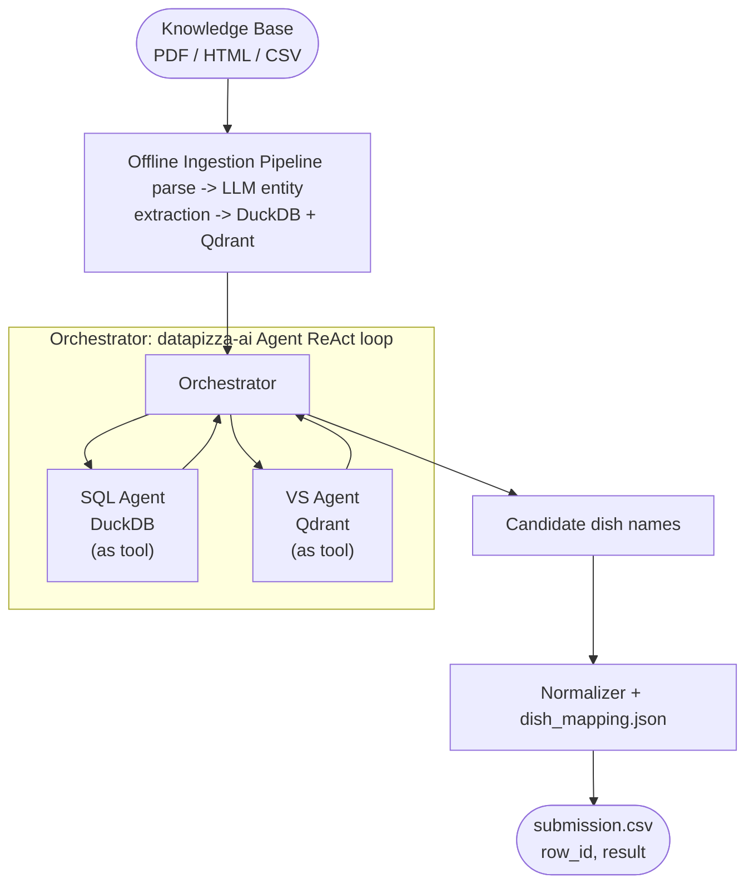

# Agentic Structured RAG

A hybrid agentic RAG system that answers natural-language questions about a fictional intergalactic restaurant universe.
It combines deterministic SQL lookups against a DuckDB structured store with semantic retrieval via Qdrant, orchestrated
by an LLM-driven ReAct agent loop.

Built for the [DataPizza AI Engineer Technical Test](https://github.com/datapizza-labs/datapizza-ai).

## Design Rationale
The knowledge base is almost entirely structured, which makes "relationalize-first" the natural ingestion strategy: entity extraction -> DuckDB. 

Most of the example questions contain explicit filters and constraints that map cleanly to SQL, where a pure vector search approach would underperform.

That said, real users rarely stay within the schema you designed for them. The hybrid approach is the natural evolution i picked for the system: when someone asks "Come funziona la Marinatura Sotto Zero a Polarità Inversa?", SQL has nothing to offer, but the vector store does. 

Keeping both tools available makes the system robust to the long tail of unexpected queries, and keeps the road open for a possible future rationalization.

---

## How it works



The orchestrator exposes exactly two tools, `call_sql_agent` and `call_qdrant_agent`, and drives a bounded ReAct loop to
gather evidence before producing a final JSON answer `{"candidates": [...]}`.

## Benchmarks
The evaluation was done on the SQL agent alone, as there isn't enough time to pick a model and finetune the orchestrator prompt (e.g: qwen3.5 has the tendency to be over cautious and triple-check things, gemma4 aggressively YOLOs queries without thinking twice).

See [`docs/BENCHMARK_RESULTS.md`](docs/BENCHMARK_RESULTS.md) for a log of the experiments done during development.

**TLDR:** With Gemma4 26B A4B (MoE) running only the SQL agent, Jaccard score is 79.0540 with positive results from all
question categories. There is still room for both improvement and use of smaller models.

---

## 🐋 Docker Quick start

The entrypoint supports four modes controlled by the `MODE` environment variable:

| MODE            | Description                                                                                               |
|-----------------|-----------------------------------------------------------------------------------------------------------|
| `api` (default) | Start the FastAPI server on port 8080                                                                     |
| `ingestion`     | Run the full ingestion pipeline. You can skip this step if you extract the data.zip folder from releases. |
| `inference`     | Run inference + generate submission + evaluate Jaccard                                                    |
| `evaluate`      | Run Jaccard evaluation only on an existing submission                                                     |

```bash
# Build and start
docker compose up --build

# Run ingestion. You can skip this step if you extract the data.zip folder from releases.
docker compose run -e MODE=ingestion agentic-structured-rag

# Run the full pipeline (inference + kaggle conversion + jaccard)
docker compose run -e MODE=inference agentic-structured-rag

# Run only evaluations
docker compose run -e MODE=inference agentic-structured-rag

# Start API
docker compose run -e MODE=api agentic-structured-rag
```

## 🐍 Manual Quick start

### 1. Clone and install

```bash
git clone https://github.com/Manuel-Materazzo/agentic-structured-rag.git
cd agentic-structured-rag

# with uv (recommended)
uv sync

# or with pip
pip install -e .
```

### 2. Configure environment

Create a `.env` file at the project root:

```dotenv
# LLM (used for entity extraction, SQL generation, orchestration)
OPENAI_API_KEY=sk-...
OPENAI_BASE_URL=          # optional: override for local/proxy models

# Embedder (can use the same key or a different one)
OPENAI_EMBEDDER_API_KEY=sk-...
OPENAI_EMBEDDER_BASE_URL= # optional: override for local/proxy models

# Model selection (defaults shown)
LLM_MODEL=gpt-5.4-mini
EMBEDDING_MODEL=text-embedding-3-small
EMBEDDING_DIM=1536

# Qdrant, local embedded by default, uncomment for remote
# QDRANT_HOST=localhost
# QDRANT_PORT=6333
# QDRANT_API_KEY=
```

All other settings have sensible defaults. See [Configuration](#configuration) for the full list.

### 3. Run ingestion

**Note**: You can skip this step if you extract the data.zip folder from releases.

```bash
python src/ingestion.py
```

This parses all knowledge-base files, extracts entities via LLM, writes facts to `data/database/facts.db`, and indexes
chunk embeddings into Qdrant at `data/database/qdrant/`.

Ingestion is **idempotent**: already-processed files are skipped based on their SHA-256 hash.

### 4. Start the API server

```bash
python src/api.py
# or
uvicorn src.api:app --host 0.0.0.0 --port 8080
```

On startup the server runs a health-check, then initializes the orchestrator and both sub-agents.

---

## Running evaluations

### Batch inference (SQL Agent only)

Runs the SQL Agent against all questions in `Dataset/domande_con_risposte.csv` and saves raw results:

```bash
python src/evaluation/run_inference.py
# Output: output/inference_results.csv
```

### LLM-based qualitative evaluation

Compares predicted answers to ground truth using an LLM judge (PASS / PARTIAL / FAIL / EMPTY / ERROR):

```bash
python src/evaluation/llm_evaluation.py
# Input:  output/inference_results.csv
# Output: output/evaluated_results.csv
```

### Jaccard score (Kaggle-compatible)

```bash
python src/evaluation/generate_kaggle_submission_file.py --answers-path output/inference_results.csv
python src/evaluation/jaccard_evaluation.py --submission output/submission.csv
# Jaccard similarity score: 0.XXXX
```

## 🌍 API usage

```bash
# Ask a question
curl -X POST "http://localhost:8080/predict?question=Quali+piatti+usano+la+fermentazione+quantica?"
```

Response:

```json
{
  "candidates": [
    "Nebula di Sapori",
    "Quasar Fritto"
  ],
  "agent_trace": null
}
```

---

## Testing

```bash
pytest tests/

# Run a specific phase
pytest tests/test_phase0_spike.py      # datapizza-ai API availability
pytest tests/test_phase1_infrastructure.py  # DB + Qdrant init
pytest tests/test_phase2_ingestion_smoke.py # Ingestion smoke test
pytest tests/test_phase3_easy_pipeline.py   # Easy questions end-to-end
```

---

## Project structure

```text
src/
  api.py                       # FastAPI server
  ingestion.py                 # Ingestion CLI entry point
  app/
    config.py                  # Centralized configuration
    orchestrator.py            # ReAct orchestrator (datapizza Agent)
    agents/
      sql_agent.py             # NL -> SQL -> DuckDB
      vector_store_agent.py    # Plan -> Retrieve -> Synthesize (Qdrant)
  ingestion/
    ingestion_manager.py       # Document lifecycle (ingest/update/delete)
    knowledge_manager.py       # DuckDB + Qdrant low-level CRUD
    structured_extraction.py   # LLM entity extraction
    vision_fallback.py         # EasyOCR + GPT-4.1-mini vision fallback
    ingestors/                 # One ingestor per source type
      menu_ingestor.py
      cook_manual_ingestor.py
      galactic_code_ingestor.py
      blog_ingestor.py
      distances_ingestor.py
  model/
    menu.py                    # Pydantic models for LLM output
  evaluation/
    run_inference.py
    llm_evaluation.py
    jaccard_evaluation.py
    generate_kaggle_submission_file.py
  metrics/
    jaccard_similarity.py
  utils/
    ingestion_utils.py
    normalizer_utils.py
    sql_utils.py
data/
  database/
    facts.db                   # DuckDB: structured facts
    ingestion_log.db           # DuckDB: ingestion state machine
    qdrant/                    # Qdrant embedded storage (local default)
  parsed/                      # Cached parsed text: <sha256>.txt
Dataset/
  domande.csv                  # 100 benchmark questions
  knowledge_base/              # PDF / HTML / CSV source files
  ground_truth/
    dish_mapping.json          # {dish_name: dish_id}
output/
  submission.csv               # Final Kaggle submission
docs/
  ARCHITECTURE.md              # Detailed architecture documentation
```

---

## Configuration

All settings are read from environment variables (or `.env`). Defaults are shown below.

| Variable                      | Default                  | Description                                   |
|-------------------------------|--------------------------|-----------------------------------------------|
| `OPENAI_API_KEY`              | ,                        | LLM API key (required)                        |
| `OPENAI_BASE_URL`             | `None`                   | Custom base URL for LLM                       |
| `OPENAI_EMBEDDER_API_KEY`     | ,                        | Embedder API key (required)                   |
| `OPENAI_EMBEDDER_BASE_URL`    | `None`                   | Custom base URL for embedder                  |
| `LLM_MODEL`                   | `gpt-5.4-mini`           | Model used everywhere                         |
| `LLM_TEMPERATURE`             | `0.0`                    | LLM temperature                               |
| `LLM_MAX_TOKENS`              | `4096`                   | Max tokens per response                       |
| `EMBEDDING_MODEL`             | `text-embedding-3-small` | OpenAI embedding model                        |
| `EMBEDDING_DIM`               | `1536`                   | Embedding vector size                         |
| `QDRANT_HOST`                 | `None`                   | Remote Qdrant host (local path used if unset) |
| `QDRANT_PORT`                 | `6333`                   | Remote Qdrant port                            |
| `QDRANT_API_KEY`              | `None`                   | Remote Qdrant API key                         |
| `QDRANT_LOCATION`             | `data/database/qdrant`   | Local Qdrant path                             |
| `QDRANT_SEARCH_LIMIT`         | `10`                     | Max results per semantic search               |
| `QDRANT_SCORE_THRESHOLD`      | `0.3`                    | Min score threshold (config)                  |
| `CHUNK_MAX_CHAR_MENU`         | `1000`                   | Max chars per menu chunk                      |
| `CHUNK_MAX_CHAR_MANUAL`       | `1200`                   | Max chars per manual chunk                    |
| `CHUNK_MAX_CHAR_CODE`         | `1200`                   | Max chars per galactic code chunk             |
| `CHUNK_MAX_CHAR_BLOG`         | `1000`                   | Max chars per blog chunk                      |
| `MAX_HANDOFFS_EASY`           | `2`                      | ReAct step budget for Easy questions          |
| `MAX_HANDOFFS_MEDIUM`         | `3`                      | ReAct step budget for Medium questions        |
| `MAX_HANDOFFS_HARD`           | `5`                      | ReAct step budget for Hard questions          |
| `OTEL_EXPORTER_OTLP_ENDPOINT` | `None`                   | OpenTelemetry endpoint (optional)             |
| `OTEL_SERVICE_NAME`           | `datapizza-ai-mvp`       | Service name for tracing                      |

---

## Architecture

See [`docs/ARCHITECTURE.md`](docs/ARCHITECTURE.md) for a detailed description of:

- DuckDB schema (all tables, columns, and normalization rules)
- Qdrant payload contract
- Ingestion pipeline phases and ingestor behavior
- Orchestrator, SQL Agent, and Vector Store Agent internals
- Document lifecycle (INSERT / UPDATE / DELETE / health-check)
- Evaluation scripts and submission format
