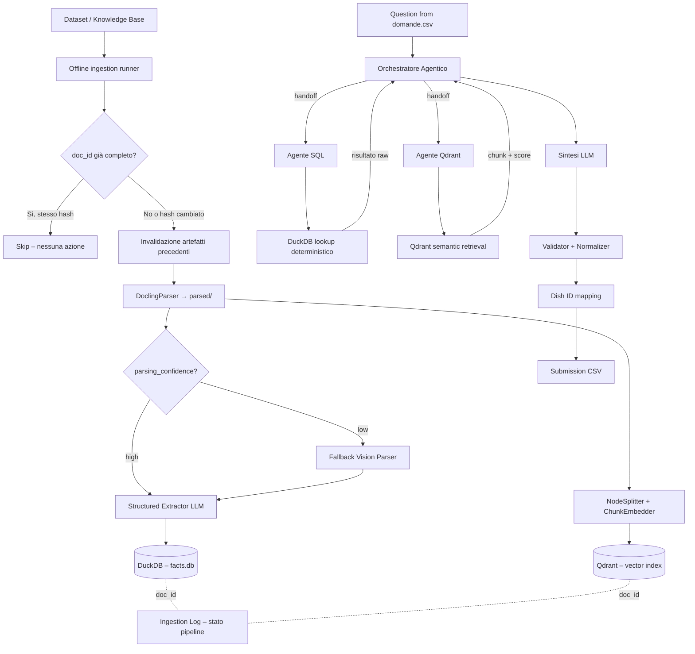

# Architettura MVP - Assistente AI per viaggiatori intergalattici

## 1. Obiettivo

Costruire un MVP che risponda alle 100 domande del dataset `Dataset/domande.csv` restituendo, per ogni domanda, l'elenco dei piatti corretti da convertire poi negli ID richiesti dalla submission finale.

Il sistema deve:

- interpretare domande in linguaggio naturale
- recuperare evidenze da PDF, CSV e pagine HTML
- combinare informazioni semantiche e strutturate
- produrre una lista deterministica di piatti
- esportare un CSV nel formato richiesto dall'evaluation

L'architettura adottata è **ibrida**:

- un orchestratore agentico in loop gestisce pianificazione e delega
- sub-agenti specializzati eseguono lookup deterministici (SQL) o semantici (vector)
- LLM usato come orchestratore, normalizzatore e sintetizzatore — mai come unica fonte di verità


## 2. Vincoli del task

Dal `README.md` emergono alcuni vincoli importanti:

- le domande sono 100
- la difficoltà è distribuita così: `Easy` 48, `Medium` 28, `Hard` 18, `Impossible` 6
- la ground truth non va usata a runtime
- la submission deve contenere `row_id` e `result`
- `result` è una stringa di ID separati da virgola
- la metrica è Jaccard similarity media: conviene massimizzare precisione e recall dell'insieme finale di piatti

Conseguenza pratica:

- l'output deve essere stabile e spiegabile
- gli errori di over-generation abbattono il punteggio Jaccard: il sistema deve filtrare bene i candidati
- è preferibile una pipeline con controllo esplicito rispetto a un agente completamente libero

---

## 3. Perché datapizza-ai

Il framework `datapizza-ai` è un requisito inattaccabile del progetto. Le primitive utili per questo caso d'uso sono:

- `Agent` per orchestrazione con tool
- `IngestionPipeline` per ingestione e indicizzazione documentale
- `DagPipeline` per costruire workflow RAG componibili
- `DoclingParser` e `NodeSplitter` per parsing e chunking
- `ChunkEmbedder` e `OpenAIEmbedder` per embeddings
- `QdrantVectorstore` per il retrieval
- `ChatPromptTemplate` e `ToolRewriter` per riscrittura query e prompting
- `ContextTracing` per osservabilità e debug

**Nota operativa:** prima di avviare l'implementazione è necessaria una spike tecnica di 1-2 giorni per verificare empiricamente che le API citate siano stabili e complete nella versione corrente del repository. Un framework interno o semi-pubblico può avere breaking changes non documentati.
[datapizza-ai repository](https://github.com/datapizza-labs/datapizza-ai)

---

## 4. Principio architetturale

Il sistema segue un modello a due livelli con ruoli distinti e non intercambiabili:

```mermaid
graph TD
    A[RAW DOCUMENTS] --> B[CHUNKING + EMBEDDING + ENTITY EXTRACTION (via LLM)]
    
    subgraph Storage [Livello Data Store]
        C[QDRANT <br><i>source of truth semantica</i>]
        D[DUCKDB <br><i>vista strutturata derivata</i>]
    end
    
    B --> C
    B --> D
    
    C --> E[ORCHESTRATORE AGENTICO]
    D --> E
    
    E --> F[SUB-AGENTI SPECIALIZZATI]
    F --> G[SINTESI + NORMALIZZAZIONE]
    G --> H[SUBMISSION CSV]
```

| Componente | Ruolo |
|------------|-------|
| Qdrant | Memoria completa e interrogazione semantica |
| DuckDB | Strato strutturato per vincoli, join e query deterministiche |
| Orchestratore | Loop agentico che pianifica, delega e sintetizza |
| Sub-agenti | Esecuzione specializzata di SQL o vector search |

**Principio fondamentale:** DuckDB non è la fonte primaria della conoscenza, ma una **vista materializzata interrogabile** derivata dai chunk di Qdrant. Qdrant è il layer autorevole; DuckDB è ottimizzato per query deterministiche sul sottoinsieme di fatti estratti.

---

## 5. Visione d'insieme



---

## 6. Fonti dati e ruolo di ciascuna

### 6.1 Menu PDF

Contengono le informazioni più importanti per la maggior parte delle domande:

- nome del ristorante, chef, pianeta, licenza dello chef
- elenco di 10 piatti con ingredienti, tecniche e quantità
- (alcuni) descrizione narrativa della preparazione

Usi principali:

- `Easy`: ingredienti e tecniche
- `Medium`: pianeta e licenza
- `Hard` e `Impossible`: evidence di base

### 6.2 Manuale di Cucina PDF

Contiene certificazioni, ordini professionali, tecniche culinarie e macrocategorie. Fondamentale per risolvere riferimenti indiretti (es. "un piatto preparato secondo i principi dell'Ordine X" → tecnica Y → lookup SQL).

### 6.3 Distanze CSV

Matrice delle distanze tra pianeti. Caricata direttamente in DuckDB come tabella `planet_distances` — non indicizzata in Qdrant.

### 6.4 Codice Galattico PDF

Limiti quantitativi sugli ingredienti e vincoli licenza-tecnica. Usato principalmente per `Hard` e `Impossible`.

### 6.5 Blog post HTML

Dettagli supplementari su alcuni ristoranti. Necessari solo per `Impossible`, in combinazione con il Codice Galattico.

---

## 7. Modello logico interno e architettura dello storage

### 7.1 Entità

- `Restaurant`: `name`, `chef`, `planet`, `chef_license`, `professional_orders`, `source_docs`, `source_chunks`
- `Dish`: `name`, `restaurant_name`, `ingredients`, `techniques`, `preparation_notes`, `regulated_ingredients`, `source_docs`, `source_chunks`
- `Technique`: `name`, `macro_category`, `required_license_level`
- `PlanetDistance`: `from_planet`, `to_planet`, `distance_ly`
- `ComplianceRule`: `ingredient`, `max_quantity_grams`, `required_technique`, `required_license`, `scope`, `source_docs`

### 7.2 Asset persistenti

```text
data/
  raw/          # copie dei file sorgente
  parsed/       # output Docling normalizzato
  database/     # DuckDB database file (facts.db), Qdrant collections (embedded), ingestion_log.db
```

### 7.3 Schema DuckDB (`facts.db`)

```sql
CREATE TABLE documents (
    doc_id       TEXT PRIMARY KEY,  -- sha256 del contenuto file
    source_path  TEXT NOT NULL,     -- path relativo nella KB (es. menu/ristorante_x.pdf)
    source_type  TEXT NOT NULL,     -- 'menu' | 'manual' | 'codice' | 'blog' | 'distanze'
    ingested_at  TIMESTAMP NOT NULL
);

CREATE TABLE restaurants (
    id                  INTEGER PRIMARY KEY,
    name                TEXT NOT NULL,
    chef                TEXT,
    planet              TEXT,
    chef_license        TEXT,       -- livello licenza dichiarato nel menu
    professional_orders TEXT[],     -- ordini professionali citati
    doc_id              TEXT REFERENCES documents(doc_id)
);

CREATE TABLE dishes (
    id                INTEGER PRIMARY KEY,
    name              TEXT NOT NULL,
    restaurant_id     INTEGER REFERENCES restaurants(id),
    preparation_notes TEXT,
    doc_id            TEXT REFERENCES documents(doc_id)
);

CREATE TABLE dish_ingredients (
    dish_id         INTEGER REFERENCES dishes(id),
    ingredient      TEXT NOT NULL,
    quantity_grams  FLOAT,          -- NULL se non quantificabile o non specificato
    quantity_raw    TEXT NOT NULL,  -- testo originale, sempre presente
    is_regulated    BOOLEAN DEFAULT FALSE,
    PRIMARY KEY (dish_id, ingredient)
);

CREATE TABLE dish_techniques (
    dish_id   INTEGER REFERENCES dishes(id),
    technique TEXT NOT NULL,
    PRIMARY KEY (dish_id, technique)
);

-- Popolata dal Manuale di Cucina
CREATE TABLE technique_taxonomy (
    technique              TEXT PRIMARY KEY,
    macro_category         TEXT NOT NULL,
    required_license_level TEXT
);

-- Popolata dal Distanze CSV
CREATE TABLE planet_distances (
    planet_a    TEXT NOT NULL,
    planet_b    TEXT NOT NULL,
    distance_ly FLOAT NOT NULL,
    PRIMARY KEY (planet_a, planet_b)
);

-- Popolata dal Codice Galattico
CREATE TABLE compliance_rules (
    id               INTEGER PRIMARY KEY,
    rule_type        TEXT NOT NULL,  -- 'ingredient_limit' | 'technique_license'
    subject          TEXT NOT NULL,  -- nome ingrediente o tecnica
    constraint_value TEXT NOT NULL, -- quantità massima o livello licenza richiesto
    scope            TEXT,           -- contesto della norma (es. 'per piatto')
    doc_id           TEXT REFERENCES documents(doc_id)
);
```

Ogni tabella relazionale mantiene la colonna `doc_id` come foreign key verso la tabella `documents` per abilitare la tracciabilità della provenienza dei dati e la gestione coordinata del ciclo di vita.

**Note sul campo quantità:**

- `quantity_grams` è `FLOAT` con punto decimale (non virgola): compatibile con DuckDB e Python senza parsing aggiuntivo.
- `quantity_raw` preserva sempre il testo originale estratto dal PDF come fallback e audit trail.
- Casi come "quanto basta", "tracce", "a piacere" producono `quantity_grams = NULL` e non `0.0`, che avrebbe semantica diversa.
- Durante l'ingestion, se `quantity_grams` risulta fuori da un range plausibile per l'ingrediente, viene loggato un warning e forzato a `NULL`.

### 7.4 Payload Qdrant
Il payload associato ai vettori in Qdrant agisce come una vera e propria interfaccia contrattuale stabilita tra il layer semantico e quello strutturato. Ogni punto registrato in Qdrant deve obbligatoriamente includere questo payload minimo:

```json
{
  "chunk_id":    "uuid-generato-all-ingestione",
  "doc_id":      "sha256-del-file-sorgente",
  "source_path": "menu/ristorante_x.pdf",
  "source_type": "menu",
  "page":        3,
  "section":     "Piatto: Galassia di Sapori",
  "restaurant":  "Ristorante X",
  "dish":        "Galassia di Sapori",
  "text":        "...testo del chunk..."
}
```
I campi `doc_id` e `chunk_id` forniscono la chiave di unione logica indispensabile per orchestrare update, delete o invalidazioni sui due motori di persistenza.

### 7.5 Rapporto tra structured store e vector store

| Store | Cosa contiene | Quando si usa |
|---|---|---|
| **DuckDB** | Fatti normalizzati, relazioni, regole | Lookup deterministici esatti |
| **Qdrant** | Chunk testuali, embedding, metadati | Retrieval semantico, disambiguazione, fallback |

#### Il ruolo del `doc_id` nella coerenza di sistema
L'identificativo unico `doc_id` viene calcolato deterministicamente come `sha256(file_content)` del file sorgente e si ramifica simmetricamente all'interno dei due motori:

---

## 8. Pipeline di ingestion

### 8.1 Parsing e segnale di confidenza

Il parsing via `DoclingParser` produce un output testuale che viene valutato dal LLM di entity extraction. Il LLM restituisce obbligatoriamente un campo di confidenza:

```json
{
  "dishes": [...],
  "parsing_confidence": "low",
  "parsing_issues": "struttura piatto-ingredienti non riconoscibile"
}
```

Se `parsing_confidence` è `low`, l'ingestion runner rilancia lo stesso documento in modalità **vision** prima di procedere. Il risultato vision alimenta lo stesso LLM di entity extraction con lo stesso prompt strutturato — il fallback è trasparente al resto della pipeline.

La soglia di "low" è definita come: "non sono riuscito a estrarre entità coerenti", non "il testo era disordinato". Questo evita che il fallback vision diventi il path principale.

### 8.2 Entity extraction via LLM

Tutta l'estrazione strutturata da PDF è delegata a un LLM con prompt strutturato, inclusa la normalizzazione delle quantità. Il LLM è istruito a:

- estrarre ingredienti, tecniche, quantità, licenze e pianeti per ogni piatto
- normalizzare le quantità in grammi con punto decimale dove possibile
- segnalare esplicitamente i casi non quantificabili
- restituire JSON con schema fisso e nessun testo libero aggiuntivo

### 8.3 Ciclo di vita dei documenti

Per assicurare la massima consistenza ed evitare che modifiche sui file della Knowledge Base lascino i database in uno stato divergente, viene introdotta una base dati dedicata al tracking dello stato dei file (`ingestion_log.db`), che ospita la tabella seguente:

```sql
CREATE TABLE ingestion_log (
    doc_id        TEXT PRIMARY KEY,
    source_path   TEXT NOT NULL UNIQUE,  -- path relativo nella KB
    content_hash  TEXT NOT NULL,         -- sha256 del contenuto (= doc_id)
    status        TEXT NOT NULL,         -- ciclo degli stati transizionali
    last_updated  TIMESTAMP NOT NULL,
    error_message TEXT                   -- null se nessun errore
);

Lo stato di ogni documento è tracciato in `ingestion_log.db`:

```
pending → parsing → parsed → extracting → extracted → embedding → indexed → complete
                                                                           ↘ failed
```

#### Protocollo INSERT

```python
def ingest_document(source_path: str):
    content = read_file(source_path)
    doc_id = sha256(content)

    existing = ingestion_log.get(source_path)
    if existing and existing.doc_id == doc_id and existing.status == "complete":
        return  # già processato, skip

    ingestion_log.upsert(source_path, doc_id, status="pending")

    try:
        # 1. Parsing dei testi
        ingestion_log.set_status(doc_id, "parsing")
        parsed = docling_parser.parse(content)

        # segnale di confidenza dal LLM
        extraction_result = structured_extractor.extract(parsed, doc_id=doc_id)
        if extraction_result.parsing_confidence == "low":
            parsed = vision_parser.parse(content)
            extraction_result = structured_extractor.extract(parsed, doc_id=doc_id)

        save_to_parsed_dir(doc_id, parsed)
        ingestion_log.set_status(doc_id, "parsed")

        # 2. Scrittura nello structured store
        ingestion_log.set_status(doc_id, "extracting")
        duckdb.write(extraction_result.facts)
        ingestion_log.set_status(doc_id, "extracted")

        # 3. Indicizzazione nel vector store
        ingestion_log.set_status(doc_id, "embedding")
        chunks = node_splitter.split(parsed, doc_id=doc_id)
        embeddings = chunk_embedder.embed(chunks)
        qdrant.upsert(embeddings)
        ingestion_log.set_status(doc_id, "indexed")

        ingestion_log.set_status(doc_id, "complete")
    except Exception as e:
        ingestion_log.set_status(doc_id, "failed", error=str(e))
        raise
```

#### Protocollo UPDATE (Documento modificato o sostituito)
L'aggiornamento scatta quando si rileva che `sha256(new_content) != ingestion_log[source_path].doc_id`. Al fine di blindare la consistenza, la pipeline applica rigorosamente il principio **"prima si invalida il vecchio, poi si inserisce il nuovo"**:

```python
def update_document(source_path: str):
    new_content = read_file(source_path)
    new_doc_id = sha256(new_content)

    existing = ingestion_log.get(source_path)
    if not existing:
        return ingest_document(source_path)
    if existing.doc_id == new_doc_id:
        return

    old_doc_id = existing.doc_id

    # 1. Purga dal vector index
    qdrant.delete(filter={"doc_id": old_doc_id})

    # 2. Rimozione a cascata da DuckDB
    duckdb.execute("DELETE FROM dish_techniques WHERE dish_id IN (SELECT id FROM dishes WHERE doc_id = ?)", [old_doc_id])
    duckdb.execute("DELETE FROM dish_ingredients WHERE dish_id IN (SELECT id FROM dishes WHERE doc_id = ?)", [old_doc_id])
    duckdb.execute("DELETE FROM dishes WHERE doc_id = ?", [old_doc_id])
    duckdb.execute("DELETE FROM restaurants WHERE doc_id = ?", [old_doc_id])
    duckdb.execute("DELETE FROM compliance_rules WHERE doc_id = ?", [old_doc_id])
    duckdb.execute("DELETE FROM documents WHERE doc_id = ?", [old_doc_id])

    # 3. Pulizia parsed dir
    delete_from_parsed_dir(old_doc_id)

    # 4. Nuova ingestione
    ingest_document(source_path)
```

#### Protocollo DELETE

```python
def delete_document(source_path: str):
    existing = ingestion_log.get(source_path)
    if not existing:
        return

    doc_id = existing.doc_id
    qdrant.delete(filter={"doc_id": doc_id})

    duckdb.execute("DELETE FROM dish_techniques WHERE dish_id IN (SELECT id FROM dishes WHERE doc_id = ?)", [doc_id])
    duckdb.execute("DELETE FROM dish_ingredients WHERE dish_id IN (SELECT id FROM dishes WHERE doc_id = ?)", [doc_id])
    duckdb.execute("DELETE FROM dishes WHERE doc_id = ?", [doc_id])
    duckdb.execute("DELETE FROM restaurants WHERE doc_id = ?", [doc_id])
    duckdb.execute("DELETE FROM compliance_rules WHERE doc_id = ?", [doc_id])
    duckdb.execute("DELETE FROM documents WHERE doc_id = ?", [doc_id])

    delete_from_parsed_dir(doc_id)
    ingestion_log.delete(source_path)
```

#### Recovery e health check

- I record in stato `failed` vengono ritentati da un worker dedicato (`retry_failed()`).
- All'avvio, prima di abilitare il runtime delle query, viene eseguito un controllo di coerenza O(n_documenti) tra i `doc_id` in DuckDB e Qdrant. Gli elementi orfani vengono rielaborati via `update_document`.

### 8.4 Strategie di chunking per tipo di fonte

| Fonte | Strategia |
|---|---|
| Menu PDF | Chunk per piatto/sezione; fallback 700-1200 caratteri |
| Manuale di Cucina | Chunk per sezioni e sottosezioni; metadata: `section_title`, `topic` |
| Codice Galattico | Chunk per sezioni normative; estrazione strutturata verso `compliance_rules` |
| Distanze CSV | Caricamento diretto in DuckDB; non indicizzato in Qdrant |
| Blog HTML | `DoclingParser` se preserva struttura; fallback BeautifulSoup; chunk semantici con gerarchia h1/h2/h3 |

---

## 9. Architettura agentica a runtime

### 9.1 Principio generale

Il runtime è strutturato come un **loop agentico a tre livelli**:

```
ORCHESTRATORE (loop principale)
    ↓ handoff
SUB-AGENTE SQL  /  SUB-AGENTE QDRANT  (esecuzione specializzata)
    ↓ risultato raw
ORCHESTRATORE (lettura, decisione, eventuale nuovo handoff)
    ↓ quando ha tutto
SINTESI FINALE
```

L'orchestratore non è un router statico: pianifica la strada, esplicita il ragionamento prima di ogni handoff, legge il risultato e decide autonomamente se fare un ulteriore handoff o se ha già abbastanza evidenze per rispondere.

### 9.2 Orchestratore

**Responsabilità:**
- ricevere la domanda e il `row_id`
- leggere lo schema DuckDB per capire quali entità e relazioni sono disponibili
- pianificare il percorso di retrieval esplicitando il ragionamento
- stimare la complessità della domanda e auto-assegnarsi un budget di handoff
- delegare ai sub-agenti tramite **due soli tool in linguaggio naturale** (vedi §11.2)
- leggere i risultati raw e decidere se convergere o fare un altro handoff
- sintetizzare la risposta finale

**Tool esposti all'orchestratore: solo due.**
L'orchestratore non dispone di lookup atomici specializzati (per ingrediente, per tecnica, per pianeta, ecc.). Dispone esclusivamente di:

```python
call_sql_agent(request: str) -> dict   # delega NL all'agente SQL
call_qdrant_agent(request: str) -> dict  # delega NL all'agente Qdrant
```

La traduzione da linguaggio naturale a SQL — incluse le query che attraversano più tabelle in un'unica chiamata — è responsabilità dell'agente SQL, non dell'orchestratore. Esporre all'orchestratore un menu di lookup atomici (per ingrediente, per tecnica, per pianeta, per distanza…) creerebbe una falsa separazione: richiederebbe all'orchestratore di scegliere il tool giusto, il che equivale ad aver già capito la domanda, ma senza poter sfruttare la capacità di composizione SQL dell'agente. Inoltre i lookup atomici non coprono le query ibride più comuni (es. "piatti di ristoranti su pianeti entro 10 anni luce che usano tecniche di licenza B"), che richiedono comunque un join multi-tabella.

**Budget di handoff:**
L'orchestratore stima la complessità prima di iniziare il loop e si auto-vincola:
- domande semplici (ingrediente/tecnica espliciti): max 1-2 handoff
- domande medie (pianeta, licenza): max 3 handoff
- domande complesse (distanze, compliance, blog): max 5 handoff

Il budget è una stima, non un limite rigido invalicabile, ma l'orchestratore deve esplicitare nel proprio ragionamento se decide di superarlo e perché.

**Gestione dei zero results su SQL:**
Zero risultati dall'agente SQL non sono una risposta finale. Sono un segnale che il termine cercato potrebbe non essere un valore diretto nella tabella (es. un ordine professionale invece di una tecnica). In questo caso l'orchestratore deve fare un handoff a Qdrant per disambiguare prima di riprovare con SQL.

**Formato del piano (serializzabile per debug):**
```json
{
  "question": "Quali piatti usano tecniche dell'Ordine dei Cuochi Quantistici?",
  "reasoning": "L'ordine professionale non è una colonna DuckDB. Devo prima risolvere quale tecnica corrisponde all'ordine tramite Qdrant, poi filtrare su dish_techniques.",
  "budget": 3,
  "next_handoff": "qdrant",
  "query": "Ordine dei Cuochi Quantistici tecnica associata"
}
```

### 9.3 Agente SQL

**Responsabilità:**
- ricevere una richiesta in linguaggio naturale dall'orchestratore
- tradurre in SQL corretto sullo schema DuckDB noto
- eseguire la query
- ritornare il risultato raw con nomi colonne

**Loop interno:** se la query fallisce per errore sintattico o ritorna un errore di schema, l'agente può fare un auto-retry con auto-correzione — massimo 2 tentativi. Non fa loop esplorativi. Non interpreta il risultato: restituisce i dati così come sono.

**Non sintetizza:** la decisione su cosa fare con il risultato appartiene all'orchestratore.

### 9.4 Agente Qdrant

**Responsabilità:**
- ricevere una query semantica dall'orchestratore
- eseguire il retrieval sulla collection appropriata
- ritornare chunk con score e metadata

**Loop interno:** se il retrieval produce zero risultati o score troppo bassi, l'agente può riformulare la query e riprovare su una collection diversa — massimo 2 tentativi. Non sintetizza e non filtra per contenuto: restituisce i chunk così come sono con i relativi score.

**Collection disponibili:**
- `menu_index`
- `manual_index`
- `code_index`
- `blog_index`

### 9.5 Tre rami decisionali

L'orchestratore può scegliere tra tre strategie, combinabili nel corso del loop:

| Ramo | Quando | Rischio |
|---|---|---|
| Solo DuckDB | Entità esplicite, lookup deterministico sufficiente | Basso |
| DuckDB + Qdrant | Entità parzialmente ambigue o vincoli normativi complessi | Medio |
| Solo Qdrant | Domande narrative, dettagli da blog, contesto non modellabile | Alto (over-generation) |

Il ramo "solo Qdrant" va usato con parsimonia. Anche quando il retrieval semantico è necessario, la validazione finale sul `dish_mapping.json` funge da barriera contro candidati inventati.

---

## 10. Flusso di risposta

### 10.1 Query understanding

Input: testo domanda e `row_id`.
Output: piano di retrieval con entità estratte, vincoli logici, ragionamento esplicito e budget di handoff stimato.

### 10.2 Evidence collection

L'orchestratore esegue in sequenza logica gli handoff pianificati, collezionando risultati SQL e chunk vettoriali con riferimenti ai file di provenienza.

### 10.3 Candidate generation

Viene calcolata l'intersezione o l'unione dei piatti candidati applicando i vincoli estratti a livello di query database (es. filtrando i piatti i cui ristoranti distano oltre la soglia stabilita o i cui ingredienti violano i tetti quantitativi del Codice Galattico).

### 10.4 Answer synthesis

L'LLM riceve la domanda originale più le sole evidenze emerse dalle fasi precedenti. Il prompt impone la generazione esclusiva dei nomi dei piatti puliti. Segue una fase di validazione stringente per normalizzare la stringa ed effettuare il controllo di esistenza nel file di mapping.

---

## 11. Uso di datapizza-ai nel runtime

### 11.1 Componenti consigliati

- `OpenAIClient` configurabile da variabili d'ambiente
- `Agent` per la gestione controllata delle chiamate ai tool deterministici
- `DagPipeline` per la strutturazione del grafo di retrieval
- `ContextTracing` agganciato ad OpenTelemetry

### 11.2 Tool esposti all'orchestratore

L'orchestratore dispone di **esattamente due tool**, entrambi in linguaggio naturale:

```python
call_sql_agent(request: str) -> dict
# Delega una richiesta in linguaggio naturale all'agente SQL.
# L'agente traduce autonomamente in SQL sullo schema DuckDB noto,
# gestisce join multi-tabella, esegue la query e restituisce il risultato raw.

call_qdrant_agent(request: str) -> dict
# Delega una query semantica in linguaggio naturale all'agente Qdrant.
# L'agente sceglie la collection appropriata, esegue il retrieval
# e restituisce chunk con score e metadata.
```

**Perché non lookup atomici separati.**
Una lista di tool specializzati (`lookup_dish_by_ingredient`, `lookup_planet_distance`, `lookup_compliance_limit`, ecc.) introduce un problema strutturale: per scegliere il tool giusto, l'orchestratore deve già aver interpretato la domanda, ma senza poter sfruttare la capacità di composizione SQL dell'agente sottostante. Il risultato è rigidità senza vantaggio: i lookup atomici non coprono le query ibride più comuni (es. "piatti di ristoranti su pianeti entro 10 anni luce che usano tecniche di licenza B"), che richiedono un join multi-tabella che un agente SQL con schema completo gestisce in un'unica chiamata. La complessità di routing viene spostata sull'orchestratore invece di tenerla dove appartiene, cioè nell'agente SQL.

**Tool deterministici interni all'agente SQL.**
Le funzioni di lookup atomico (`lookup_dish_by_ingredient`, `lookup_planet_distance`, ecc.) possono comunque esistere come helper Python interni all'agente SQL — usate dall'agente per costruire o validare le proprie query — ma non sono esposte all'orchestratore.

### 11.3 Esempio di organizzazione del grafo

```python
dag = DagPipeline()
dag.add_module("orchestrator", Agent(
    client=llm,
    tools=[call_sql_agent, call_qdrant_agent],  # due soli tool NL
    system_prompt=ORCHESTRATOR_SYSTEM_PROMPT
))
dag.add_module("normalizer", answer_normalizer)
dag.add_module("mapper", dish_id_mapper)
```

---

## 12. Strategia di reasoning per livello di difficoltà

### 12.1 Easy

Match lessicale immediato su DuckDB. L'orchestratore converge tipicamente in 1 handoff. L'LLM interviene solo in presenza di parafrasi o sinonimi non normalizzati.

### 12.2 Medium

Incrocio tra le tabelle `dishes`, `restaurants` e i parametri relativi a pianeti o licenze degli chef. Tipicamente 2-3 handoff.

### 12.3 Hard

Risoluzione di vincoli geometrici (distanze) e tassonomici (licenze richieste per specifiche tecniche). I criteri di inclusione/esclusione vengono risolti tramite algebra degli insiemi in SQL, fornendo all'LLM un set di candidati già filtrato.

### 12.4 Impossible

Analisi incrociata tra tetti quantitativi del Codice Galattico e anomalie narrative nei blog post. Approccio iper-conservativo in fase di generazione candidati per evitare penalizzazioni Jaccard da over-generation.

### 12.5 Anti-overfitting

- I prompt si concentrano sull'estrazione di entità e vincoli astratti, mai sulla fisionomia delle 100 domande specifiche del benchmark.
- Tutti i dizionari di controllo sono compilati dinamicamente analizzando la Knowledge Base, mai cablati a mano osservando la ground truth.

---

## 13. Normalizzazione finale verso gli ID

### 13.1 Mapping

Il file `Dataset/ground_truth/dish_mapping.json` funge esclusivamente da:
- dizionario di conversione finale da stringa (nome piatto) a ID
- barriera di validazione per escludere risposte inventate

### 13.2 Regole di normalizzazione

Rimozione di spazi bianchi, standardizzazione caratteri speciali e apostrofi, confronto case-insensitive, rimozione duplicati, ordinamento numerico crescente degli ID. In caso di fallimento del match, si tenta fuzzy matching controllato; se l'incertezza persiste, il candidato viene rimosso dal set di sottomissione.

---

## 14. Osservabilità e debugging

Grazie all'integrazione nativa di `ContextTracing` via OpenTelemetry, l'applicazione registra ad ogni esecuzione:

- la domanda originale e il `row_id`
- il piano di retrieval con ragionamento esplicito dell'orchestratore
- ogni handoff: tipo (SQL/Qdrant), input, output raw, tempo di risposta
- i chunk vettoriali estratti con score
- i piani SQL eseguiti su DuckDB
- i tassi di errore in fase di mapping degli ID
- i warning di normalizzazione quantità (`quantity_grams` forzato a NULL)
- i fallback vision attivati durante l'ingestion

Il piano di retrieval serializzabile in JSON (sezione 9.2) abilita il regression testing offline: è possibile confrontare i piani prodotti su versioni diverse del sistema senza eseguire la pipeline completa.

---

## 15. Testing strategy

### 15.1 Test di ingestion

- corretto parsing strutturato dei PDF (incluso il segnale di confidenza)
- corretto fallback vision quando `parsing_confidence = low`
- corretta normalizzazione delle quantità in `quantity_grams`
- corretto allineamento degli hash nell'ingestion log

### 15.2 Test di retrieval

Batterie di test mirate su query di soli ingredienti, tecniche accoppiate, matrici di distanza e calcolo dei limiti di compliance, misurando recall e precision dei motori in isolamento.

### 15.3 Test end-to-end

Generazione della submission completa su `domande.csv` ed esecuzione automatica di `src/evaluation.py` per misurare l'indice Jaccard medio. Un golden set ridotto (5 query per livello di difficoltà) viene eseguito ad ogni commit come barriera di regressione rapida.

---

## 16. Struttura repository consigliata

```text
src/
  app/
    main.py
    config.py
    orchestrator.py        # loop agentico principale
    agents/
      sql_agent.py
      qdrant_agent.py
    tools/
      lookup_tools.py      # tool deterministici SQL
      validation_tools.py
    answer_normalizer.py
    submission.py
  ingestion/
    runner.py
    menu_ingestion.py
    manual_ingestion.py
    code_ingestion.py
    blog_ingestion.py
    distances_ingestion.py
    structured_extraction.py  # LLM entity extractor
    vision_fallback.py
  metrics/
    evaluation.py
data/
  raw/
  parsed/
  database/     # DuckDB database file (facts.db), Qdrant collections (embedded), ingestion_log.db
  cache/
output/
docs/
  architecture.md
```

---

## 17. Sequenza di implementazione

L'implementazione segue un approccio **iterativo e misurabile**, non waterfall. L'obiettivo è avere una pipeline end-to-end funzionante sul sottoinsieme Easy il prima possibile, per poter misurare il Jaccard reale e identificare i problemi prima di affrontare i livelli successivi.

- **Fase 1 (Bootstrap):** Configurazione percorsi, caricamento `dish_mapping.json`, export submission minimale vuota. Verifica spike sulle API di `datapizza-ai`.
- **Fase 2 (Ingestion base):** Parsing menu PDF, entity extraction LLM, schema DuckDB, segnale di confidenza + fallback vision. Test di estrazione su campione rappresentativo.
- **Fase 3 (Pipeline Easy):** Tool SQL deterministici, orchestratore semplificato, submission sulle domande Easy. Misurazione Jaccard. Iterazione su chunking e prompt di extraction.
- **Fase 4 (Estensione Medium/Hard):** Qdrant indexing, agente Qdrant con micro-loop, distanze, licenze. Estensione orchestratore con budget di handoff.
- **Fase 5 (Impossible):** Compliance rules da Codice Galattico, parsing blog HTML, logica incrociata. Misurazione Jaccard finale.

---

## 18. Rischi principali e mitigazioni

### 18.1 Over-generation

L'inclusione di piatti errati abbatte drasticamente il punteggio Jaccard.
*Mitigazione:* Validazione obbligatoria tramite `dish_mapping.json`; soglia conservativa sull'agente Qdrant; budget di handoff esplicito nell'orchestratore.

### 18.2 Inconsistenza dello storage (Desync)

Modifiche ai file sorgente rischiano di disallineare DuckDB e Qdrant.
*Mitigazione:* Protocollo "invalida prima, reinserisci dopo" controllato dall'ingestion log via `doc_id`.

### 18.3 Parsing inadeguato di PDF complessi

Layout con colonne, tabelle, emoji e glossari possono essere mal interpretati da Docling.
*Mitigazione:* Segnale di confidenza esplicito dal LLM di extraction; fallback vision automatico; verifica empirica su un campione di menu prima dell'implementazione.

### 18.4 Qualità dell'entity extraction

Errori in questo passaggio si propagano su entrambi gli store.
*Mitigazione:* Test di estrazione per tipo di documento; review manuale su campione rappresentativo; warning loggati per `quantity_grams` anomali.

### 18.5 Normalizzazione delle quantità

Quantità espresse in forme eterogenee ("quanto basta", "tre foglie", "500g") richiedono una normalizzazione robusta.
*Mitigazione:* LLM istruito a produrre `FLOAT` con punto decimale o `NULL` esplicito; `quantity_raw` sempre preservato; range check post-estrazione con logging dei casi anomali.

### 18.6 Eccessivo numero di handoff su domande semplici

Un orchestratore senza vincoli tende a over-investigare anche domande Easy.
*Mitigazione:* Budget di handoff auto-stimato e dichiarato nel piano prima dell'inizio del loop.

### 18.7 API instabili di datapizza-ai

Il framework è un requisito inattaccabile ma le sue API potrebbero non corrispondere alla documentazione.
*Mitigazione:* Spike tecnica obbligatoria nella Fase 1 prima di costruire qualsiasi modulo sopra.

### 18.8 Tuning del chunking

Chunk troppo grandi degradano il retrieval semantico; chunk troppo piccoli spezzano il contesto piatto-ingredienti-tecnica.
*Mitigazione:* Chunking guidato dalla struttura logica del documento con fallback a 700-1200 caratteri; calibrazione empirica nella Fase 3.

---

## 19. Definition of Done

L'MVP si considera completato con successo quando:

- tutte le fonti dati sono correttamente indicizzate e monitorate dall'ingestion log
- il segnale di confidenza e il fallback vision sono operativi e testati
- la normalizzazione delle quantità produce `FLOAT` o `NULL` esplicito con `quantity_raw` sempre valorizzato
- ogni domanda del dataset genera un output stabile e formattato
- l'orchestratore agentico esplicita il ragionamento e rispetta il budget di handoff dichiarato
- lo script di valutazione locale restituisce un punteggio Jaccard misurabile e affidabile
- il ciclo di vita INSERT/UPDATE/DELETE garantisce coerenza tra DuckDB e Qdrant senza record orfani
