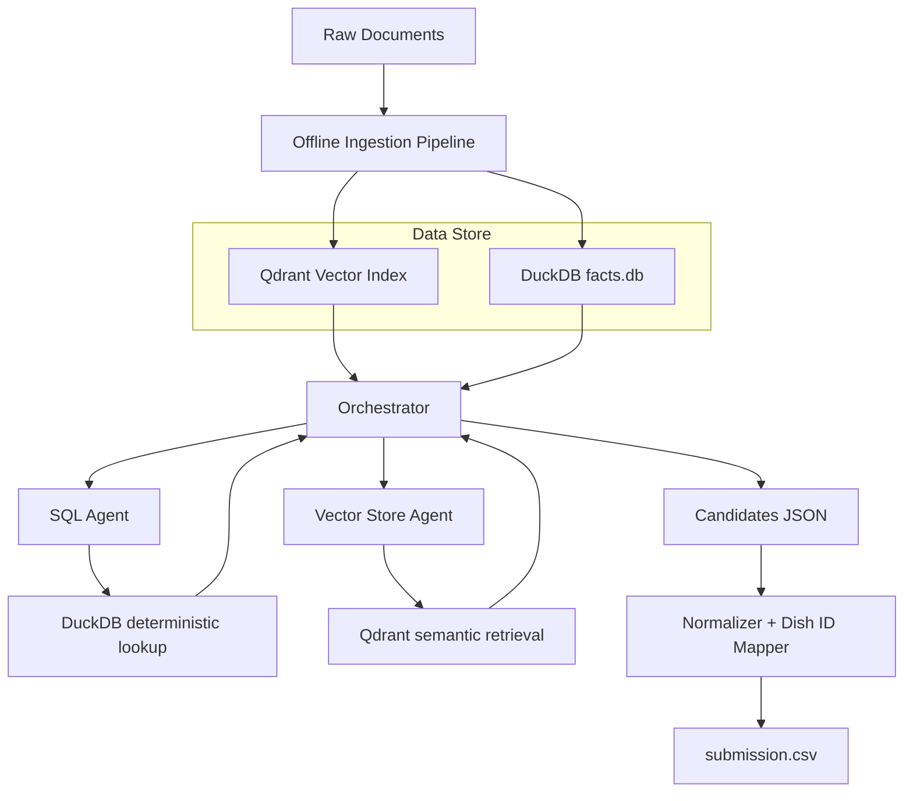

# Architettura – Agentic Structured RAG

---

## 1. Obiettivo

Costruire un MVP che risponda alle 100 domande del dataset `Dataset/domande.csv` restituendo, per ogni domanda, l'elenco dei piatti corretti da convertire poi negli ID richiesti dalla submission finale.

Il sistema deve:

- interpretare domande in linguaggio naturale (italiano)
- recuperare evidenze da PDF (menu, manuale, codice galattico), CSV (distanze) e HTML (blog)
- combinare informazioni recuperate
- produrre una lista di piatti e convertirla in ID tramite `dish_mapping.json`
- esportare un CSV nel formato `row_id,result` richiesto dalla valutazione

La metrica di valutazione e la **Jaccard similarity media** tra la lista di ID predetti e quella della ground truth: massimizzare sia precision che recall dell'insieme finale e il criterio guida.

---

## 2. Principio architetturale

Il sistema adotta un'architettura **ibrida a due livelli** con ruoli distinti e non intercambiabili:



| Componente | Ruolo |
|------------|-------|
| **Qdrant** | Memoria semantica: chunk testuali con embedding e payload |
| **DuckDB** (`facts.db`) | Fatti strutturati e relazionali: piatti, ingredienti, tecniche, licenze, distanze, compliance |
| **Orchestratore** | Loop agentico che pianifica e delega |
| **SQL Agent** | Traduce richieste in linguaggio naturale in SQL DuckDB e restituisce righe raw |
| **Vector Store Agent** | Pianifica sub-query semantiche, le esegue su Qdrant, sintetizza i chunk |

**Principio fondamentale:** DuckDB non e la fonte primaria della conoscenza, ma una vista materializzata derivata dai documenti originali. Qdrant contiene i chunk testuali autorizzati; DuckDB e ottimizzato per lookup e join deterministici.

---

## 3. Fonti dati e ruolo di ciascuna

| Fonte | Posizione nella KB | Tipo | Indicizzata in Qdrant | Caricata in DuckDB |
|---|---|---|---|---|
| Menu ristorante | `Dataset/knowledge_base/menu/` | PDF | Si (`menu_index`) | Si (piatti, ingredienti, tecniche, licenze) |
| Manuale di Cucina | `Dataset/knowledge_base/misc/` | PDF | Si (`manual_index`) | Si (`technique_taxonomy`, `technique_licenses`) |
| Codice Galattico | `Dataset/knowledge_base/codice_galattico/` | PDF | Si (`code_index`) | Si (`compliance_rules`) |
| Blog post | `Dataset/knowledge_base/blogpost/` | HTML | Si (`blog_index`) | No (solo metadati payload Qdrant) |
| Distanze CSV | `Dataset/knowledge_base/misc/Distanze.csv` | CSV | No | Si (`planet_distances`) |

---

## 4. Schema DuckDB (`data/database/facts.db`)

Lo schema e definito e creato in `knowledge_manager.py`. Tutte le stringhe testuali sono normalizzate in lowercase al momento della scrittura.

```sql
-- Registro di tutti i documenti ingeriti
CREATE TABLE documents (
    doc_id       TEXT PRIMARY KEY,  -- sha256 del contenuto file
    source_path  TEXT NOT NULL,
    source_type  TEXT NOT NULL,     -- 'menu' | 'manual' | 'codice' | 'blog' | 'distanze'
    ingested_at  TIMESTAMP NOT NULL
);

CREATE TABLE restaurants (
    id                  INTEGER PRIMARY KEY,
    name                TEXT NOT NULL,     -- lowercase
    chef                TEXT,              -- lowercase
    planet              TEXT,              -- lowercase
    professional_orders TEXT[],            -- array di ordini professionali, lowercase
    doc_id              TEXT REFERENCES documents(doc_id)
);

CREATE TABLE chef_licenses (
    restaurant_id INTEGER REFERENCES restaurants(id),
    license_type  TEXT NOT NULL,    -- shortcode: 'p','t','g','e+','mx','q','c','ltk'
    license_grade INTEGER NOT NULL, -- romani convertiti in interi (I->1, II->2, ...)
    PRIMARY KEY (restaurant_id, license_type, license_grade)
);

CREATE TABLE dishes (
    id                INTEGER PRIMARY KEY,
    name              TEXT NOT NULL,   -- lowercase
    restaurant_id     INTEGER REFERENCES restaurants(id),
    preparation_notes TEXT,
    doc_id            TEXT REFERENCES documents(doc_id)
);

CREATE TABLE dish_ingredients (
    dish_id         INTEGER REFERENCES dishes(id),
    ingredient      TEXT NOT NULL,    -- lowercase
    quantity_grams  FLOAT,            -- NULL se non quantificabile
    quantity_raw    TEXT NOT NULL,    -- testo originale (lowercase)
    is_regulated    BOOLEAN DEFAULT FALSE,
    PRIMARY KEY (dish_id, ingredient)
);

CREATE TABLE dish_techniques (
    dish_id   INTEGER REFERENCES dishes(id),
    technique TEXT NOT NULL,   -- lowercase
    PRIMARY KEY (dish_id, technique)
);

-- Popolata dal Manuale di Cucina
CREATE TABLE technique_taxonomy (
    technique      TEXT PRIMARY KEY,  -- lowercase
    macro_category TEXT NOT NULL
);

-- Popolata dal Manuale di Cucina: requisiti di licenza per tecnica (N:M)
CREATE TABLE technique_licenses (
    technique     TEXT REFERENCES technique_taxonomy(technique),
    license_type  TEXT NOT NULL,
    license_grade INTEGER NOT NULL,
    PRIMARY KEY (technique, license_type, license_grade)
);

-- Popolata dal Distanze CSV
CREATE TABLE planet_distances (
    planet_a    TEXT NOT NULL,   -- lowercase
    planet_b    TEXT NOT NULL,   -- lowercase
    distance_ly FLOAT NOT NULL,
    PRIMARY KEY (planet_a, planet_b)
);

-- Popolata dal Codice Galattico  TODO: structure rules into ingredients and licensing requirements, extract one rule per requirement
CREATE TABLE compliance_rules (
    id               INTEGER PRIMARY KEY,
    rule_type        TEXT NOT NULL,    -- 'ingredient_limit' | 'technique_license'
    subject          TEXT NOT NULL,
    constraint_value TEXT NOT NULL,
    scope            TEXT,
    doc_id           TEXT REFERENCES documents(doc_id)
);

-- Metadati per il SQL Agent (visibilita e descrizione di tabelle/colonne)
CREATE TABLE schema_meta (
    table_name  TEXT NOT NULL,
    column_name TEXT NOT NULL,  -- stringa vuota = annotazione sull'intera tabella
    visible     BOOLEAN NOT NULL DEFAULT TRUE,
    description TEXT,
    PRIMARY KEY (table_name, column_name)
);
```

**Tabelle e colonne nascoste al SQL Agent** (tramite `schema_meta`): `documents` (intera tabella), `schema_meta` (intera tabella), colonne `doc_id` in `dishes`, `restaurants`, `compliance_rules`, colonna `is_regulated` in `dish_ingredients` (non ancora popolata).

**Fuzzy matching nel SQL Agent:** l' SQL Agent usa `jaro_winkler_similarity(field, LOWER('value')) > 0.93` per i campi testuali al posto di `=` esatto, in modo da evitare typo utente e problemi di importazione, e applica `EXISTS`/`NOT EXISTS` sulle tabelle figlio (evitando JOIN multipli che causerebbero prodotti cartesiani).

---

## 5. Payload Qdrant

Ogni punto in Qdrant include questo payload minimo, costruito dalla funzione `build_payload` in `ingestion_utils.py`:

```json
{
  "chunk_id":    "uuid-generato-all-ingestione",
  "doc_id":      "sha256-del-file-sorgente",
  "source_path": "Dataset/knowledge_base/menu/ristorante_x.pdf",
  "source_type": "menu",
  "page":        null, 
  "section":     null,
  "restaurant":  "nome ristorante",
  "dish":        null,
  "text":        "...testo del chunk..."
}
```

I campi `doc_id` e `chunk_id` forniscono la chiave di join per le operazioni di delete/invalidazione sulle due basi dati. page, section e dish sono dei segnaposto per un possibile retrival avanzato futuro.

---

## 6. Pipeline di ingestion

### 6.1 Struttura generale

La pipeline e suddivisa in tre fasi eseguite sequenzialmente dall'ingestor specifico per ogni fonte. Le fasi sono idempotenti: se un documento e gia in uno stato avanzato, le fasi precedenti vengono saltate grazie all'ingestion log.

```
Fase 1 - Parse   : DoclingParser (PDF/HTML) o lettura diretta (CSV/TXT)
                   --> testo grezzo salvato in data/parsed/<doc_id>.txt
Fase 2 - Extract : LLM entity extraction con prompt specifico per source_type
                   --> scrittura in DuckDB (post_write_callback)
Fase 3 - Embed   : datapizza IngestionPipeline (DoclingParser + NodeSplitter + ChunkEmbedder)
                   --> upsert in Qdrant
```

### 6.2 Ingestors implementati

Ogni ingestor estende `BaseIngestor` e sovrascrive i metodi appropriati:

| Classe | File | Source Type | Qdrant Collection | DuckDB Tables |
|---|---|---|---|---|
| `MenuIngestor` | `menu_ingestor.py` | `menu` | `menu_index` | `restaurants`, `chef_licenses`, `dishes`, `dish_ingredients`, `dish_techniques` |
| `CookManualIngestor` | `cook_manual_ingestor.py` | `manual` | `manual_index` | `technique_taxonomy`, `technique_licenses` |
| `GalacticCodeIngestor` | `galactic_code_ingestor.py` | `codice` | `code_index` | `compliance_rules` |
| `BlogIngestor` | `blog_ingestor.py` | `blog` | `blog_index` | nessuna (solo payload Qdrant) |
| `DistancesIngestor` | `distances_ingestor.py` | `distanze` | nessuna | `planet_distances` |

**`DistancesIngestor`** bypassa le fasi 1 e 3 completamente: legge il CSV con Pandas e scrive direttamente in `planet_distances`, senza LLM ne Qdrant.

**`BlogIngestor`** utilizza `sectionize_html` (BeautifulSoup) come parser primario per strutturare i contenuti HTML per heading (h1/h2/h3), con fallback a `DoclingParser`. Non scrive tabelle relazionali in DuckDB.

### 6.3 Segnale di confidenza e fallback vision

Il LLM di entity extraction restituisce obbligatoriamente `parsing_confidence: "high" | "low"`. Se il valore e `"low"`, la pipeline attiva il **vision fallback** (`vision_fallback.py`):

1. **DoclingParser con EasyOCR** — gestisce PDF scansionati
2. **LLM dotato di vision** — converte le pagine PDF in immagini JPEG base64 e le invia al modello (max 10 pagine)

Il `BlogIngestor` e il `DistancesIngestor` disabilitano esplicitamente il vision fallback (`use_vision_fallback = False`).

### 6.4 Modello Pydantic per i menu

La struttura dell'output LLM per i menu e definita dal modello `RestaurantData` in `model/menu.py`:

```
RestaurantData
+-- restaurant: Restaurant (name, chef, planet, professional_orders)
+-- dishes: List[Dish]
|   +-- Dish (name, techniques, preparation_notes)
|       +-- ingredients: List[Ingredient] (name, quantity_grams: float|null, quantity_raw: str)
+-- licenses: List[License] (license_type: shortcode, license_grade: int)
+-- parsing_confidence: "high" | "low"
+-- parsing_issues: str | null
```

Lo schema JSON del modello Pydantic viene iniettato dinamicamente nel system prompt del `MenuIngestor`.

TODO: fare lo stesso sugli altri schema.

### 6.5 Post-processing delle quantita

Dopo l'entity extraction dei menu, `_postprocess_quantities` in `structured_extraction.py` imposta a `NULL` i valori `quantity_grams` che sono `0.0`, negativi, o superiori a 100 000 g (100 kg).

### 6.6 Ciclo di vita dei documenti (ingestion log)

Il file separato `data/database/ingestion_log.db` traccia lo stato di ogni documento:

```sql
CREATE TABLE ingestion_log (
    doc_id        TEXT PRIMARY KEY,
    source_path   TEXT NOT NULL UNIQUE,
    content_hash  TEXT NOT NULL,   -- uguale a doc_id (sha256 del file)
    status        TEXT NOT NULL,
    last_updated  TIMESTAMP NOT NULL,
    error_message TEXT
);
```

Transizioni di stato:

```
pending --> parsing --> parsed --> extracting --> extracted --> embedding --> indexed --> complete
                                                                                    |
                                                                                    +--> failed
```

**Protocollo UPDATE:** quando `sha256(new_content) != ingestion_log[source_path].doc_id`, la pipeline applica "invalida prima, reinserisci dopo":

1. Purga i punti Qdrant (`filter: doc_id = old_doc_id`) su tutte le 4 collection
2. Delete a cascata da DuckDB: `dish_techniques` --> `dish_ingredients` --> `dishes` --> `restaurants` / `compliance_rules` --> `documents`
3. Elimina il file `data/parsed/<old_doc_id>.txt`
4. Re-ingestione completa

**Recovery:** `IngestionManager.retry_failed()` ritenta tutti i documenti in stato `failed`. `health_check()` confronta i `doc_id` completi nel log con quelli presenti in `documents` DuckDB e re-ingerisce gli orfani.

---

## 7. Architettura agentica a runtime

### 7.1 Orchestratore

Implementato in `src/app/orchestrator.py` usando la primitiva `Agent` di datapizza-ai in modalita ReAct.

**Responsabilita:**
- ricevere la domanda
- pianificare il percorso di retrieval e il budget di handoff
- delegare ai sub-agenti tramite esattamente due tool
- leggere i risultati e iterare fino alla convergenza
- produrre il JSON finale `{"candidates": ["Dish Name 1", ...]}`

**Tool esposti:**

```python
call_sql_agent(request: str) -> str
# Delega una richiesta NL all'SQL Agent.
# Restituisce: "SQL agent search successful. Found N results: [...]"
# In caso di errore: "SQL agent failed. Error: ..."

call_vector_store_agent(request: str) -> str
# Delega una query semantica NL al Vector Store Agent.
# Restituisce: "Vector Store agent search successful. Findings: <testo sintetizzato>"
# Il tool e registrato nell'agente col nome "call_qdrant_agent"
```

**Parametri chiave:**
- `max_steps=10` — limite massimo di handoff nel loop ReAct
- `terminate_on_text=True` — il loop si ferma quando l'agente produce testo libero (il JSON finale)
- Budget di handoff per difficolta: Easy <= 2, Medium <= 3, Hard <= 5 (configurabili da env)

**Formato risposta atteso dall'agente:**

```json
{"candidates": ["Nome Piatto 1", "Nome Piatto 2"]}
```

Se i candidati non sono una lista valida, l'orchestratore restituisce `{"candidates": [], "error": "..."}`.

### 7.2 SQL Agent

Implementato in `src/app/agents/sql_agent.py` come layer di traduzione NL-->SQL con retry.

**Responsabilita:**
- ricevere una richiesta NL
- generare SQL corretto per DuckDB con schema fornito dinamicamente da `get_schema_overview`
- eseguire la query
- restituire `SQLAgentResult(columns, rows, sql, error)`

**Loop interno:** fino a `max_retries=2` tentativi. In caso di errore sintattico o di schema, il prompt viene arricchito con il messaggio di errore per l'auto-correzione.

**Schema presentato al LLM:** `get_schema_overview` in `sql_utils.py` filtra le tabelle e le colonne marcate `visible=FALSE` in `schema_meta`. Include anche le descrizioni delle colonne come commenti SQL (es. shortcode licenze, formato grade).

**Regole SQL critiche (nel system prompt):**
- Usare `jaro_winkler_similarity(field, LOWER('value')) > 0.93` per i campi testo (mai `=` esatto)
- Usare `EXISTS`/`NOT EXISTS` sulle tabelle figlio (mai `JOIN` multipli sullo stesso figlio)
- Single quote escapate raddoppiandole: `L''aquila`

### 7.3 Vector Store Agent

Implementato in `src/app/agents/vector_store_agent.py` come micro-orchestratore semantico a tre fasi.

**Responsabilita:**
- ricevere una query semantica NL dall'orchestratore
- pianificare sub-query per collection diverse (Planner LLM)
- eseguire le ricerche in Qdrant con embedding OpenAI
- sintetizzare i chunk grezzi in una risposta pulita (Synthesizer LLM)
- restituire `VectorStoreResult(sub_queries, raw_chunks_collected, synthesized_answer, error)`

**Fasi interne:**

1. **Planner** — il LLM riceve la richiesta e produce:
   `{"queries": [{"collection": "...", "query": "..."}], "rationale": "..."}`.
   Le collection non valide vengono filtrate; fallback su `menu_index` con la query originale.

2. **Retrieval** — per ogni sub-query: embed con `OpenAIEmbedder`, ricerca su Qdrant con `k=3`.
   Filtro score >= 0.4. I chunk vengono collezionati con score e source.

3. **Synthesizer** — il LLM sintetizza i chunk in una risposta concisa e fattuale per l'orchestratore.
   Se non ci sono chunk: `"INSUFFICIENT DATA: No relevant chunks found in vector store."`.

**Collection disponibili** (da `config.py`):

| Collection | Contenuto |
|---|---|
| `menu_index` | Menu ristorante: piatti, ingredienti, tecniche |
| `manual_index` | Manuale di Cucina: tassonomia tecniche, licenze, macro-categorie |
| `code_index` | Codice Galattico: compliance, limiti ingredienti, vincoli licenza |
| `blog_index` | Blog post narrativi: anomalie, contesto ristorante |

---

## 8. Normalizzazione e mapping verso gli ID

### 8.1 Normalizzazione testo

La funzione `normalize_text` in `normalizer_utils.py` applica:
- NFKC Unicode normalization
- trim e unificazione whitespace
- standardizzazione apostrofi
- casefold

### 8.2 Mapping

Il file `Dataset/ground_truth/dish_mapping.json` e usato **esclusivamente** come:
1. dizionario di conversione da nome piatto a ID intero
2. barriera di validazione per escludere piatti non presenti nella KB

Il mapping avviene in `generate_kaggle_submission_file.py`:
- Lookup esatto (case-sensitive)
- Lookup case-insensitive (strip + casefold)

Il fuzzy matching (tramite `difflib.get_close_matches`, cutoff 0.9) e disponibile in `map_dish_names_to_ids` e viene usato durante la valutazione offline (`run_inference.py`).

---

## 9. Struttura repository effettiva

```text
src/
  api.py                      # FastAPI server (lifespan: health_check + init agents)
  ingestion.py                # Entry point CLI per l'ingestion completa
  app/
    __init__.py
    config.py                 # Configurazione centralizzata (env vars + defaults)
    orchestrator.py           # Orchestratore agentico (datapizza Agent)
    agents/
      sql_agent.py            # LLM->SQL translator con retry
      vector_store_agent.py   # Plan->Retrieve->Synthesize pipeline semantica
  ingestion/
    __init__.py
    ingestion_manager.py      # Lifecycle: ingest / update / delete / retry / health_check
    knowledge_manager.py      # Init DuckDB + Qdrant; CRUD di basso livello
    structured_extraction.py  # LLM entity extraction + parse_json_response + post-processing
    vision_fallback.py        # DoclingParser OCR + LLM vision (GPT-4.1-mini) fallback
    ingestors/
      base_ingestor.py        # ABC con 3 fasi (parse / extract / embed)
      menu_ingestor.py        # Menu PDF --> DuckDB + Qdrant menu_index
      cook_manual_ingestor.py # Manuale PDF --> DuckDB + Qdrant manual_index
      galactic_code_ingestor.py # Codice PDF --> DuckDB + Qdrant code_index
      blog_ingestor.py        # HTML blog --> Qdrant blog_index (nessuna tabella DuckDB)
      distances_ingestor.py   # CSV --> DuckDB planet_distances (nessun LLM, nessun Qdrant)
  model/
    menu.py                   # Pydantic models: RestaurantData, Dish, Ingredient, License
  evaluation/
    generate_kaggle_submission_file.py  # dish_mapping loader + export submission CSV
    run_inference.py                    # SQL Agent inference batch su domande_con_risposte.csv
    llm_evaluation.py                  # LLM judge: PASS/PARTIAL/FAIL/EMPTY/ERROR
    jaccard_evaluation.py              # CLI: calcola Jaccard locale vs ground truth
  metrics/
    jaccard_similarity.py     # Implementazione Jaccard (Kaggle-compatible)
  utils/
    ingestion_utils.py        # build_payload, sectionize_html, split_text, delete_qdrant_points_by_doc_id
    normalizer_utils.py       # normalize_text, map_dish_names_to_ids, extract_dishes_from_rows
    sql_utils.py              # get_schema_overview, run_sql, QueryResult
    validation_utils.py       # Validation helpers
    argparser_utils.py        # CLI argument parsers
data/
  raw/                        # Copie dei file sorgente
  parsed/                     # Cache testi estratti: <doc_id>.txt
  database/
    facts.db                  # DuckDB: schema principale
    ingestion_log.db          # DuckDB: ingestion state machine
    qdrant/                   # Qdrant embedded (path locale di default)
  cache/
Dataset/
  domande.csv                 # 100 domande del benchmark
  domande_con_risposte.csv    # Domande + ground truth (per valutazione offline)
  knowledge_base/
    menu/                     # PDF menu ristoranti
    misc/                     # Distanze.csv + Manuale di Cucina.pdf
    codice_galattico/         # PDF Codice Galattico
    blogpost/                 # HTML blog post
  ground_truth/
    dish_mapping.json         # {dish_name: dish_id}
    ground_truth_mapped.csv   # Ground truth in formato Kaggle
output/
  submission.csv              # Output finale del sistema
tests/
  test_phase0_spike.py        # Smoke test API datapizza-ai
  test_phase1_infrastructure.py # Test DB + Qdrant init
  test_phase2_ingestion_smoke.py # Test ingestion pipeline
  test_phase3_easy_pipeline.py   # Test query Easy end-to-end
docs/
  ARCHITECTURE.md             # Questo documento
```

---

## 10. Configurazione

Tutta la configurazione e centralizzata in `src/app/config.py` e leggibile da variabili d'ambiente:

| Variabile | Default | Descrizione |
|---|---|---|
| `OPENAI_API_KEY` | *(obbligatoria)* | Chiave API per LLM e embedder |
| `OPENAI_BASE_URL` | `None` | Base URL personalizzato (proxy/modelli locali) |
| `OPENAI_EMBEDDER_API_KEY` | *(obbligatoria)* | Chiave API per l'embedder (puo differire dal LLM) |
| `OPENAI_EMBEDDER_BASE_URL` | `None` | Base URL personalizzato per l'embedder |
| `LLM_MODEL` | `gpt-5.4-mini` | Modello LLM per extraction, agenti, orchestratore |
| `LLM_TEMPERATURE` | `0.0` | Temperatura LLM |
| `LLM_MAX_TOKENS` | `4096` | Max token risposta |
| `EMBEDDING_MODEL` | `text-embedding-3-small` | Modello embedding OpenAI |
| `EMBEDDING_DIM` | `1536` | Dimensione vettori embedding |
| `QDRANT_HOST` | `None` | Host Qdrant remoto (se `None` usa storage locale) |
| `QDRANT_PORT` | `6333` | Porta Qdrant remoto |
| `QDRANT_API_KEY` | `None` | API key Qdrant remoto |
| `QDRANT_LOCATION` | `data/database/qdrant` | Path Qdrant embedded locale |
| `QDRANT_SEARCH_LIMIT` | `10` | Numero massimo di risultati per ricerca semantica |
| `QDRANT_SCORE_THRESHOLD` | `0.3` | Soglia minima score config (agent usa 0.4 internamente) |
| `CHUNK_MAX_CHAR_DEFAULT` | `1000` | Lunghezza massima chunk (default) |
| `CHUNK_MAX_CHAR_MENU` | `1000` | Lunghezza massima chunk per menu |
| `CHUNK_MAX_CHAR_MANUAL` | `1200` | Lunghezza massima chunk per manuale |
| `CHUNK_MAX_CHAR_CODE` | `1200` | Lunghezza massima chunk per codice galattico |
| `CHUNK_MAX_CHAR_BLOG` | `1000` | Lunghezza massima chunk per blog |
| `MAX_HANDOFFS_EASY` | `2` | Budget handoff per domande Easy |
| `MAX_HANDOFFS_MEDIUM` | `3` | Budget handoff per domande Medium |
| `MAX_HANDOFFS_HARD` | `5` | Budget handoff per domande Hard |
| `OTEL_EXPORTER_OTLP_ENDPOINT` | `None` | Endpoint OpenTelemetry (opzionale) |
| `OTEL_SERVICE_NAME` | `datapizza-ai-mvp` | Nome servizio per tracing |

---

## 11. Testing

| File | Scope |
|---|---|
| `tests/test_phase0_spike.py` | Verifica che le API di datapizza-ai siano stabili e accessibili |
| `tests/test_phase1_infrastructure.py` | Init DuckDB schema, init Qdrant collections, ingestion log |
| `tests/test_phase2_ingestion_smoke.py` | Ingestion end-to-end su un campione ridotto di documenti |
| `tests/test_phase3_easy_pipeline.py` | Orchestratore + SQL Agent su domande di categoria Easy |
